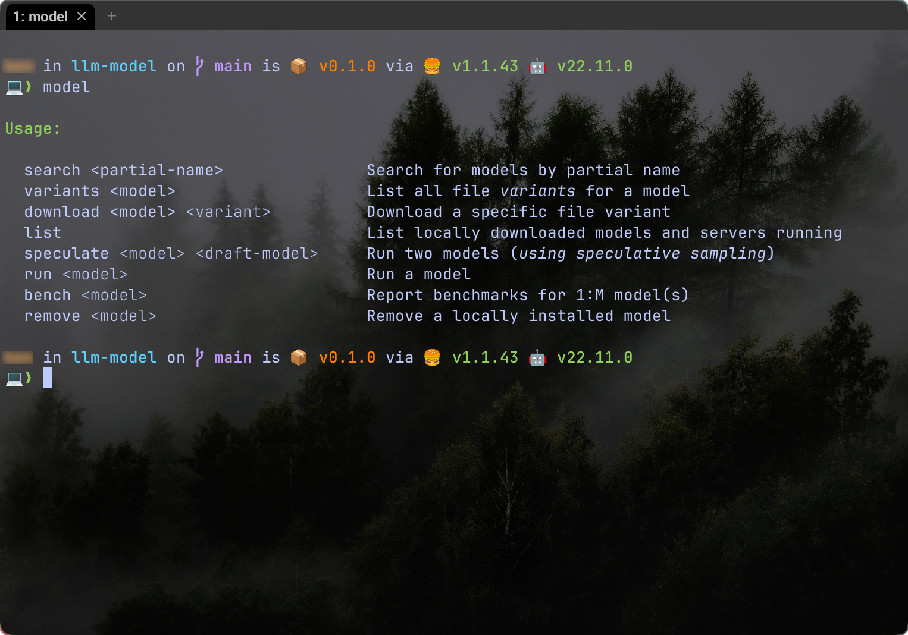
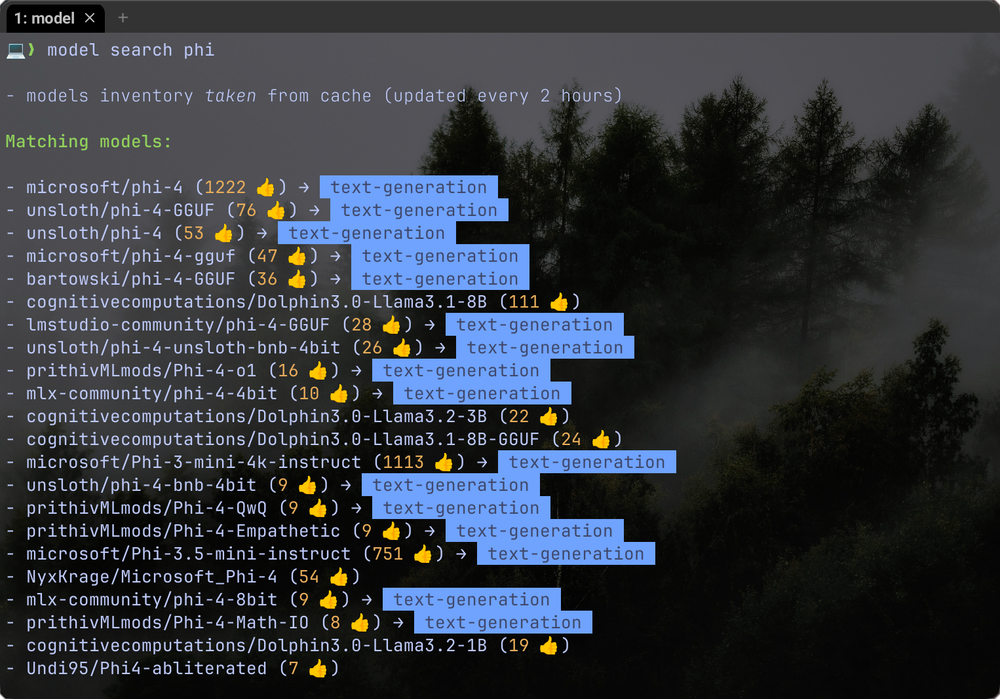
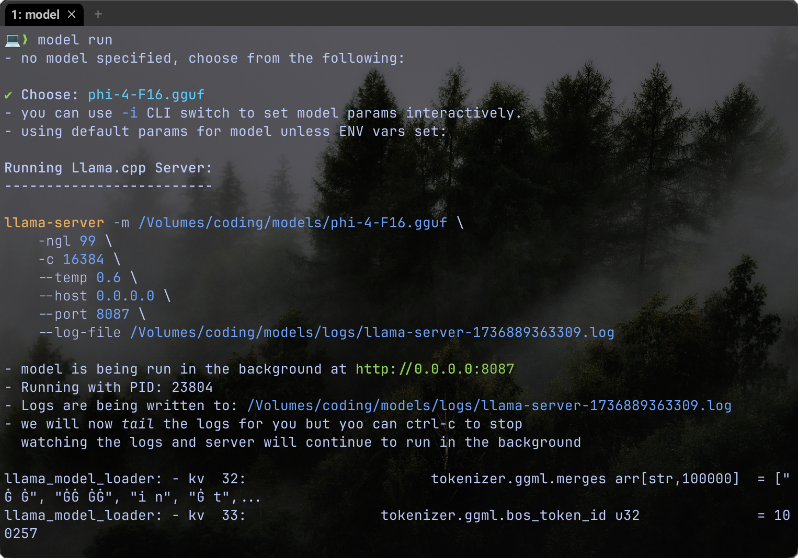
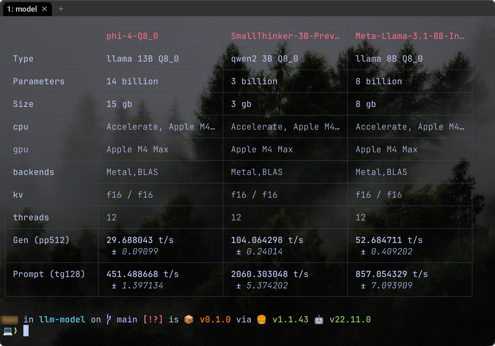

# LLM Model



## Installation

```sh
bun install -g @yankeeinlondon/llm-model
```

## Features

- 👓 allows easy searching of Hugging Face models from command line

    

- 🏃‍➡️ run singular models or dual models using _speculative sampling_.
  - allows for interactive input or pure CLI model specification

    

- Benchmark
  - produces tabular format for easy comparison (JSON also available)
  - caches results so that quick cross-model views are possible
  - you can give a partial match for model name _or_ run interactively

    

- List and Lifecycle


