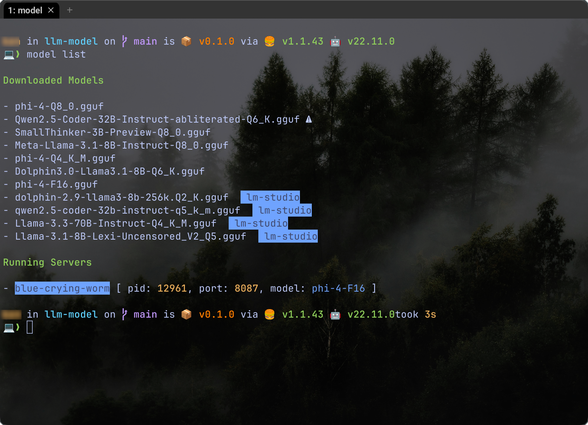
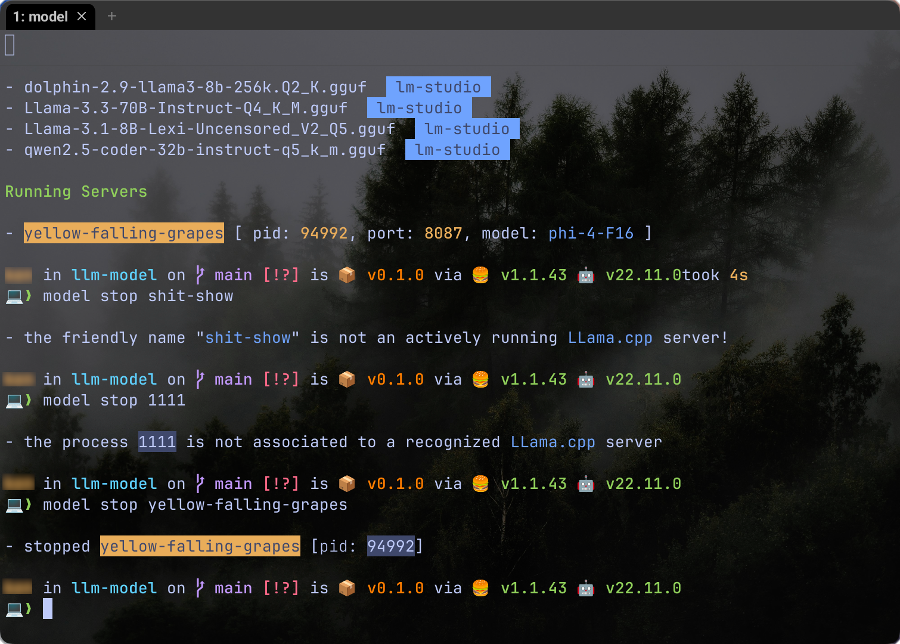

# LLM Model


## Installation

```sh
bun install -g @yankeeinlondon/llm-model
```

## Features


### Search

- allows easy searching of Hugging Face models from command line

    

### Model Serving

- Run singular models or use _speculative sampling_ with two models running in parallel
- allows for interactive input or pure CLI model specification

    


### Benchmarking

- produces tabular format for easy comparison (JSON also available)
- caches results so that quick cross-model views are possible
- you can give a partial match for model name _or_ run interactively

    

### List and Lifecycle

- List all local models available for serving
- List any currently running servers

    

- stop servers with a `PID`,  _friendly name reference_, or stop all with `all`

    

